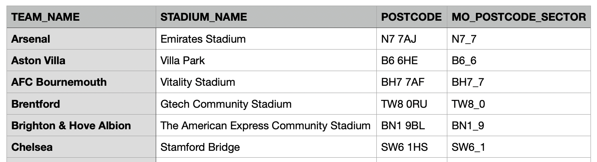
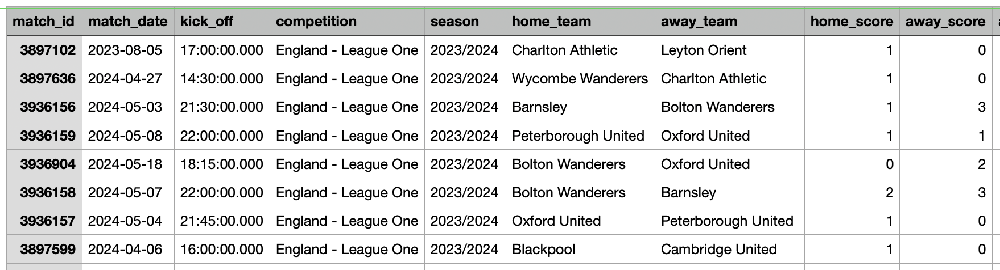
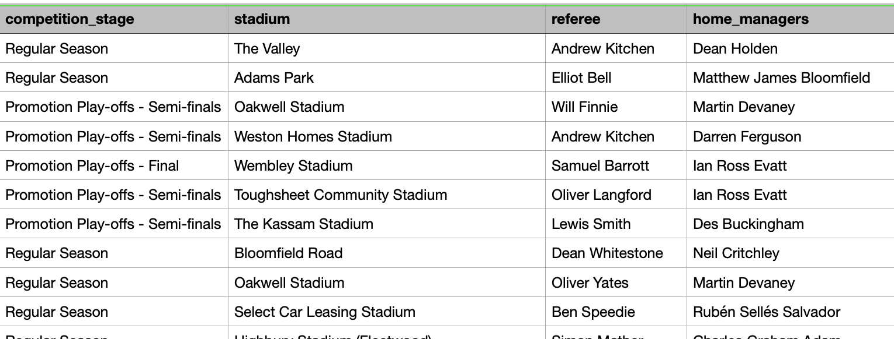
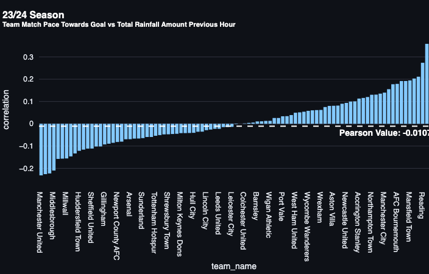
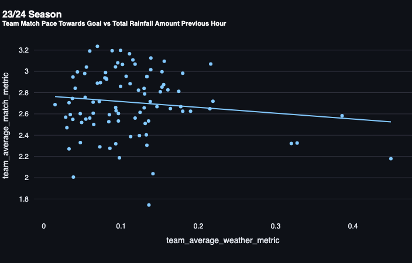
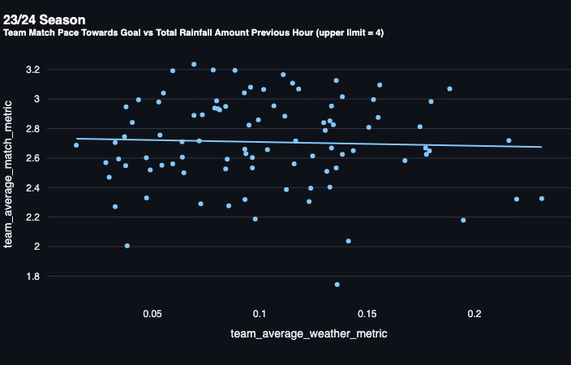
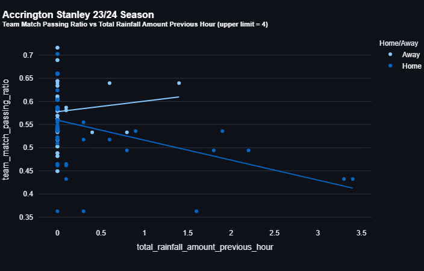

One of the most powerful aspects of data science is its ability to
quantify real world phenomena. To use a popular example in the realm of
football, fans have always recognised that some chances are of a higher
quality than others - a six-yard tap-in is clearly more likely to result
in a goal than a 30-yard volley - but the advent of expected goals (xG)
and other metrics has changed the way we analyse and understand the
game.

But what about the influence of weather? While we might instinctively
feel that a rain-slicked pitch and strong crosswinds can affect styles
of play, these effects are rarely quantified. Can the elements actually
influence styles of play or match outcomes? Using Met Office weather
observation data in conjunction with StatsBomb data for the 23/24
season, I'll explore the impacts of adverse weather conditions on
football playing methods.

This project grew in scope quite quickly, so I broke it up into two
articles. The first will begin by breaking down the data collection
process, before explaining the analysis approach and finally the
observations and correlation between rain and directness and pace
towards goal, as well as secondary metrics such as ball in play time.
The second article will focus on the impacts of wind and temperature.

## Data Collection and Cleansing

Tools used:

- Snowflake (data collection and manipulation)
- Python (football data collection and manipulation)
- Streamlit (data bisualisation web app)

This analysis is based on Met Office weather observations for UK
postcodes, and therefore includes match data for the entire English
Premier League, Championship, League One and League Two. I selected the
23/24 season as the most recent full season of data, but if there\'s
interest I\'ll aim to update this analysis later with past and current
season data to increase the sample size.

### Stadiums 

I gathered a list of Stadiums in the UK with the help of Google and
ChatGPT, then tweaked the team names and stadium names to match those
used by StatsBomb. I then ran a simple function to translate the
postcode to the Met Office postcode sector format (e.g. 'PL2 3DQ' -\>
'PL2_3'). This would allow me to look up the weather observations for a
particular stadium postcode sector.

### Met Office Weather Observations

Met Office "best estimate" observations via the Snowflake Marketplace.
Sourced from Nowcast Analysis - a technique for very short-range
forecasting.This combines their station, satellite and radar
observations onto a 2km grid, with terrain adjustment to interpolate
between station locations, giving a best estimate of actual weather
conditions in population centres. A new observation is produced every
hour for each postcode in the UK, and includes the parameters listed
below as well as several others such as solar elevation angle and
visibility screen level.

I selected the following columns as the most likely to have an impact on
playing conditions:

| Column                              | Definition                                                                        |
| ----------------------------------- | --------------------------------------------------------------------------------- |
| Total_rainfall_amount_previous_hour | Amount of rainfall in the previous hour measured in millimetres.                  |
| Wind_speed_10m                      | Average wind speed over the previous 15 minutes at 10m above the ground.         |
| Wind_gust_10m                       | Extreme value of wind speed over the previous 15 minutes at 10m above the ground. |
| Feels_like_temperature              | Approximate temperature in celsius over the previous hour.                        |

See full datasheets here:

- [**Nowcast Datasheet**](https://www.metoffice.gov.uk/binaries/content/assets/metofficegovuk/pdf/data/nowcasting-datasheet_2019.pdf)
- [**Postcode Sector Datasheet**](https://www.metoffice.gov.uk/binaries/content/assets/metofficegovuk/pdf/data/postcode-sector-data-parameters-and-locations.pdf)

### StatsBomb Season Matches

A basic overview of each match in the four leagues for the 23/24 season,
gathered using the \`matches\` method of the StatsBombPy library. (I later realised that I could have saved time by inserting the
postcode/postcode sector reference into the match metrics instead of
creating my separate stadium list.)

Using stadium postcode sectors and match timestamps in a join, I created
a new table containing the match overviews and observations within three
hours of kick off timestamps. For example, a 3PM kick-off would return
the 3PM, 4PM and 5PM observations to hopefully give a full picture of
the weather conditions just before and during the match.

I also performed some minor datetime manipulation after discovering that
StatsBomb kick off times are published in Eastern European Time (UTC+2),
a fact that was quite well hidden in the StatsBomb documentation.

### StatsBomb Team Match Metrics 

Using the match IDs from the Season Matches dataset I gathered the
detailed team match metrics for all matches across the four leagues. It
includes over 150 different metrics, from "Goals scored from throw-ins"
to "Shots generated from high press" to "Percentage of opponent dribbles
completed".

This article focuses mainly on team match directness and match pace
towards goal. These are both metrics which measure a team's directness,
with team_match_directness measuring the pitch distance travelled in
buildup a shot (e.g. more horizontal passes = greater distance = lower
directness value), and \`team_match_pace_towards_goal\` measuring from
the start of possession to the shot in metres per second.

I also selected a few additional columns that I felt could potentially
be affected by weather conditions. These are shown in the table below:

| Column                               | Definition                                                                                                                                                |
| ------------------------------------ | --------------------------------------------------------------------------------------------------------------------------------------------------------- |
| Team_match_directness                | A ratio of the distance towards goal from the start of a possession that ended in a shot, divided by the total distance travelled in buildup to the shot. |
| Team_match_pace_towards_goal         | The average speed of buildup for possessions that end in shots, from the start of possession to shot (m/s)                                                |
| Team_match_gk_pass_distance          | Average length of pass from a goalkeeper when playing out from the back.                                                                                  |
| Team_match_gk_long_pass_ratio        | Percentage of goalkeeper long passes that are completed.                                                                                                  |
| Team_match_ball_in_play_time         | Actual clock time the ball spends in play                                                                                                                 |
| Team_match_dribble_ratio             | Percentage of dribbles that were completed                                                                                                                |
| Team_match_high_press_shots_conceded | Shots conceded from possessions that were lost within 5 seconds of a opposition defensive action in the team's half                                       |
| Team_match_passing_ratio             | Passing completion rate.                                                                                                                                  |

This is a sample of the available metrics that I selected as I felt they
could be impacted by weather conditions. For example, a wet surface
might cause a team to lose possession more frequently under a high
press, or high wind speeds could result in fewer successful long range
passes. I would welcome suggestions on other relevant StatsBomb metrics
for analysis.

### Team Match Stats + Weather Metrics

The final dataset was created by joining the combined weather
observation and match overview data with the detailed match metrics,
joining on match ID. This resulted in a table containing team metrics
and weather conditions for every 23/34 match.

## Approach

I aimed to find any correlations between match metrics and weather
conditions using Pearson correlation. This method shows how two
variables relate, with values ranging from -1 to 1: +1 means both
increase together, -1 means one increases as the other decreases, and 0
means no relationship.

As such, I was looking to see if there was a strong positive or negative
correlation between any of the metrics and adverse weather conditions
(evidenced by diagonal trendlines in scatter graphs, as shown below).

I created a small [Streamlit](https://streamlit.io/) web
app to visualise the data and determine if there was any correlation
between rainy/windy conditions and the match metrics. All the graphs
seen from this point were generated in the Streamlit app.

## Overall Observations

The values for \`total_rainfall_previous_hour\` ranged between 0 (for
the absence of any rain) and a maximum value of 28.9 which was linked to
a match between Arsenal and Manchester United on 12th May 2024. I
initially thought this was a bug in the data - the next highest values
in the dataset are 17.9 and 10.8 before dropping into single digits.

This match famously saw the roof of Old Trafford leaking huge amounts of
water, proving to be a useful test case for the data collection.

Visualising the Pearson correlation in a bar chart we can see that
coefficient for pace towards goal and rainfall is close to 0.

If we switch to a scatter graph we can see a small negative trend
between rainfall and pace towards goal.

However, in all cases the trendline appears to be skewed negatively by
four weather data outliers highlighted below.

Notably, two of these teams are Manchester United and Arsenal, the other
two are Watford and West Brom. Two pairs of teams which participated in
a match with extreme rain conditions.

At this point it seemed appropriate to
[winsorise](https://en.wikipedia.org/wiki/Winsorizing) the
weather metric outliers ("clamping" the values so that anything above a
certain threshold is set to the threshold value) thereby reducing the
effect of the outliers on our analysis. According to the Met Office,
rain at a rate of [[4mm or more per
hour]{.underline}](https://www.metoffice.gov.uk/binaries/content/assets/metofficegovuk/pdf/services/government/using-the-map-and-accessing-the-weather-layers-beta.pdf)
is termed "Heavy Rain", so this seems like an appropriate value to use
as our upper limit.

When we apply the 4mm rainfall clamp we no longer see the scatter chart
trendline "dragged down" for directness and pace towards goal. The
result is a nearly flat trendline, indicating no correlation between
rainfall and directness.

The table below shows the correlation between Total Rainfall Previous
Hour (upper values trimmed to 4mm/hr) and various match metrics:
| Match Metric                         | Pearson Value |
| ------------------------------------ | ------------- |
| team_match_pace_towards_goal         | \-0.0029      |
| team_match_directness                | \-0.0014      |
| team_match_gk_pass_distance          | 0.001         |
| team_match_gk_long_pass_ratio        | 0.0006        |
| team_match_ball_in_play_time         | 0.0149        |
| team_match_dribble_ratio             | 0.0122        |
| team_match_high_press_shots_conceded | \-0.004       |
| team_match_passing_ratio             | \-0.0009      |

We can see from the above table that there is no significant correlation
between rainfall and the selected match metrics. The most significant
trends are Ball In Play Time and Successful Dribble Ratio increasing
with rainfall, but these are still within a range that could be
considered coincidental.

## Team Observations

While there aren't any obvious overarching trends, we can see some
interesting data points if we take a granular, per-team view.

### Plymouth Argyle

As a Plymouth Argyle fan, I was curious to note that they had a higher
than average correlation between rainfall and various match metrics.
Argyle employed a direct, transitional style of football and had the
highest average pace to goal in the Championship for 23/24. For example,
goalkeeper passing distance (0.132), directness (0.199) and pace towards
goal (0.155) all increased with the levels of rainfall. The effect was
slightly more pronounced for away games, reflecting an increased
tendency to "go long", particularly in wet conditions.

### West Bromwich Albion

Another team whose goalkeeper passing distance increased drastically
away from home, and under rain conditions (Pearson 0.294). Across the
whole season Alex Palmer was 5th lowest for goalkeeper long
passes in the Championship, attempting 4.48 per game. This tactic
appeared to completely revert when playing in the rain, and particularly
in away matches as shown in the scatter graph below.

### Accrington Stanley

Accrington were significant data outliers when comparing passing
completion percentage with rainfall. Their passing success decreased in
correlation with increased rain, resulting in a Pearson value of -0.306.
Their average passing ratio was one of the lowest in the division
overall with 68%, an issue that was compounded for home games in wet
conditions. This could point to poor drainage at the Wham Stadium
contributing to incomplete passes.

### Leeds United

Leeds saw a large decrease in ball in play time in relation to rainfall
(Pearson -0.297). However, the Leeds matches which saw the most rainfall
included opposition such as Millwall, Rotherham, Preston and
Huddersfield - all teams with below average ball in play time so it's
likely that this correlation is purely coincidental and has nothing to
do with the weather conditions.

## Final Thoughts

From this analysis there appeared to be no obvious, overarching trends
between increased rainfall and directness of play or any of the
secondary metrics such as goalkeeper passing length, match in ball time
or high press shots conceded. This is at least somewhat notable by
itself, as many fans might assume rain a "leveller" of sorts.

Given that the majority of matches don't experience heavy rain or wind,
a single season of data isn\'t really enough to gain meaningful
insights. While winsorising the data reduced the impacts of data
outliers skewing the analysis, a larger sample size would further help
to alleviate this issue.

There are many variables at play during a match such as team tactics,
game state, opposition quality which impact playing patterns far more
directly than the weather. This makes it difficult to find the signal in
the noise - as we saw in the Leeds United example their correlation was
more likely caused by the opposition than playing conditions.

Another factor to consider is the modernisation of stadiums and pitch
technology which have lessened the impacts of rain and wind. Drainage
systems prevent build up of water on grass, and a bowl-shaped stadium
may be better protected from wind than open-cornered ones.

Finally, this study has only scratched the surface of analysing
weather's impact on football. I will update this blog with another
article exploring the effect of wind and temperature based on the Met
Office data, but my long term goal is to build a model that evaluates
the impact over thousands of games and help to predict future match
outcomes. To do this, I'll need not only a single season of UK data but
multiple seasons across different countries. The [Open Meteo Historical
Weather
API](https://open-meteo.com/en/docs/historical-weather-api)
looks like a great starting point for this.

\> If you'd like access to the Streamlit app, give me a shout on
[[BlueSky]{.underline}](https://bsky.app/profile/matthewgirdler.com),
[[Twitter]{.underline}](https://twitter.com/mattgirdler) or
[[LinkedIn]{.underline}](https://www.linkedin.com/in/matt-girdler-5740a3a7/)
and I'll pass on the details.
